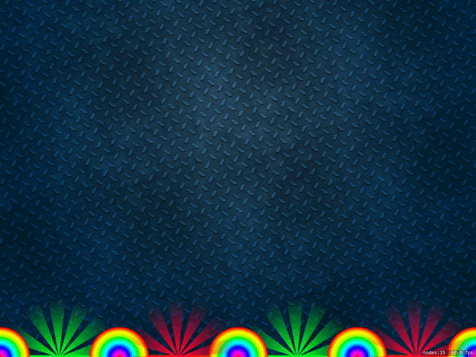

# 100 Days of Swift - "Pachinko" iOS App

**Start Date: June 5, 2019  
End Date: September 13, 2019**

I want to learn how to program in the Swift language. To this end, I will practice coding in Swift for at least one hour every day for 100 days.

This is an example iOS project produced by [*Hacking with Swift*](https://www.hackingwithswift.com/read) called ["Pachinko"](https://www.hackingwithswift.com/read/11/overview). This app is the game of pachinko. I will post images below of the view of the app after each day's work.

## Daily progress of "Pachinko" app

**Day 1 - July 6, 2019**

I have set up the app and learned how to add `SKSpriteNode` objects and have them act according to accurate physics. I also used an `SKAction` to have the glows at the bottom rotate constantly.

We further learned about how to read collisions and add animations. I finished the challenges which included a few new game features, using the skills learned above.

