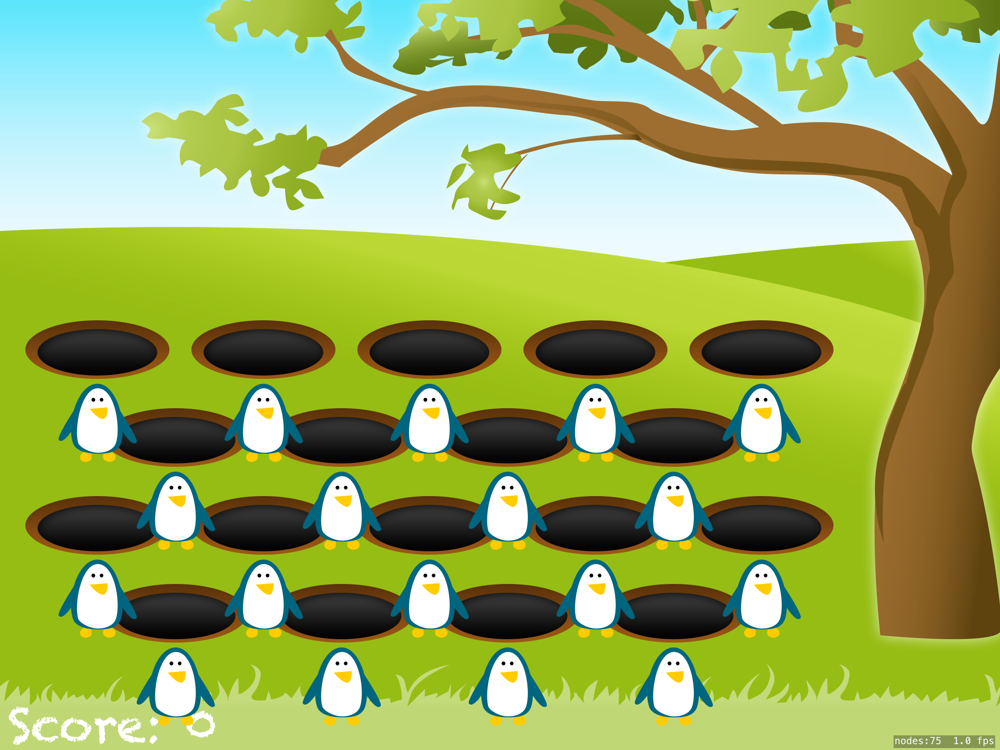
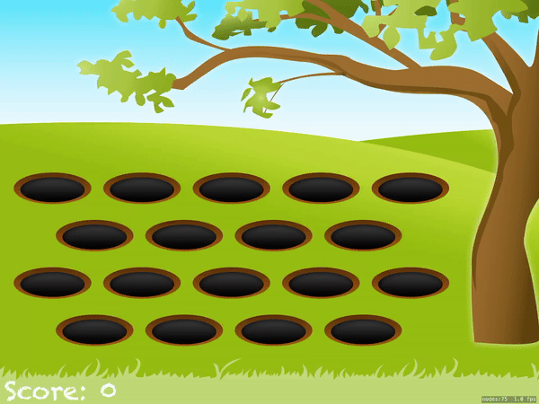

# 100 Days of Swift - "Whack-a-Penguin" iOS App

**Start Date: June 5, 2019  
End Date: September 13, 2019**

I want to learn how to program in the Swift language. To this end, I will practice coding in Swift for at least one hour every day for 100 days.

This is an example iOS project produced by [*Hacking with Swift*](https://www.hackingwithswift.com/read) called ["Whack-a-Penguin"](https://www.hackingwithswift.com/read/14/overview). This app is a game simillar to Whack-a-Mole. I will post images below of the view of the app after each day's work.

## Daily progress of "Whack-a-Penguin" app

**Day 1 - July 12, 2019**

The general set up is ready. We will be using cropping masks to hide the penguins, though I'm still not confident in what that means. I will have to experiment a little to become more comfortable with them.

**Day 2 - July 13, 2019**

Completed the app, except for the challenges at the end of the section. I learned a few more methods available for `SKActions` and how to think about the gameplay.

