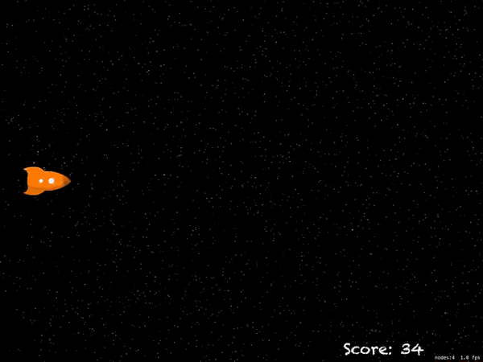

# 100 Days of Swift - "Space Race" iOS App

**Start Date: June 5, 2019  
End Date: September 13, 2019**

I want to learn how to program in the Swift language. To this end, I will practice coding in Swift for at least one hour every day for 100 days.

This is an example iOS project produced by [*Hacking with Swift*](https://www.hackingwithswift.com/read) called ["Space Race"](https://www.hackingwithswift.com/read/17/overview). This app is designed to teach me about using MapKit. I will post images below of the view of the app after each day's work.

## Daily progress of "Space Race" app

**Day 1 - July 15, 2019**

I got a fresh Xcode game project set-up. Nothing to show just yet.

**Day 2 - July 16, 2019**

I learned a bit more about SpriteKit, and got some good  practice dealing with touches as  I tried to implement a few new features on my own. Overall, a pretty simple app that demonstrates the power of SpriteKit.

