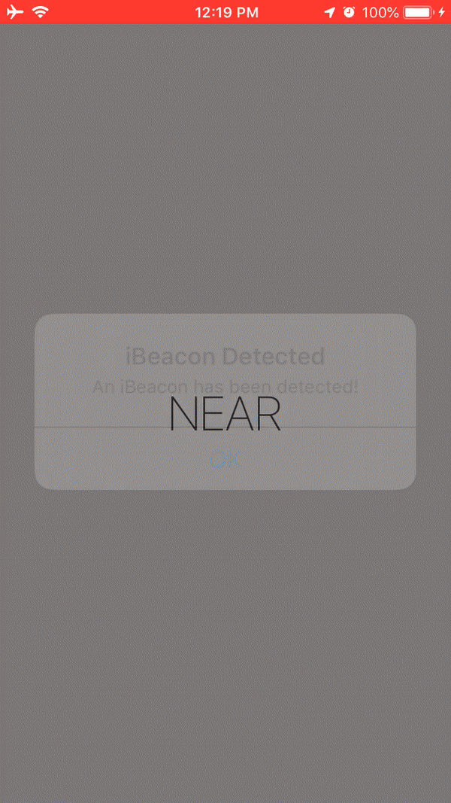

# 100 Days of Swift - "Detect a Beacon" iOS App

**Start Date: June 5, 2019  
End Date: September 13, 2019**

I want to learn how to program in the Swift language. To this end, I will practice coding in Swift for at least one hour every day for 100 days.

This is an example iOS project produced by [*Hacking with Swift*](https://www.hackingwithswift.com/read) called ["Detect a Beacon"](https://www.hackingwithswift.com/read/22/overview). This app is designed to teach me about interacting with physical devices using iBeacon. I will post images below of the view of the app after each day's work.

## Daily progress of "Detect a Beacon" app

**Day 1 - July 22, 2019**

I learned how to detect and react to an iBeacon.

