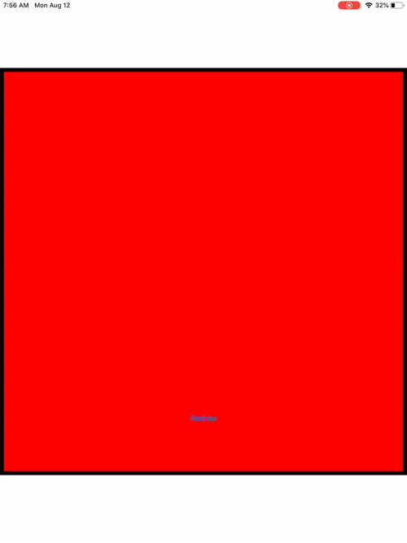

# 100 Days of Swift - "Core Graphics" iOS App

**Start Date: June 5, 2019  
End Date: September 13, 2019**

I want to learn how to program in the Swift language. To this end, I will practice coding in Swift for at least one hour every day for 100 days.

This is an example iOS project produced by [*Hacking with Swift*](https://www.hackingwithswift.com/read) called ["Core Graphics"](https://www.hackingwithswift.com/read/27/overview). This app is designed to teach me about drawing with Core Graphics. I will post images below of the view of the app after each day's work.

## Daily progress of Core Graphics" app

**Day 1 - August 12, 2019**

I finished the core portion of this tutorial. It was interesting to see how I could program in specific shapes and designs using Core Graphics.

