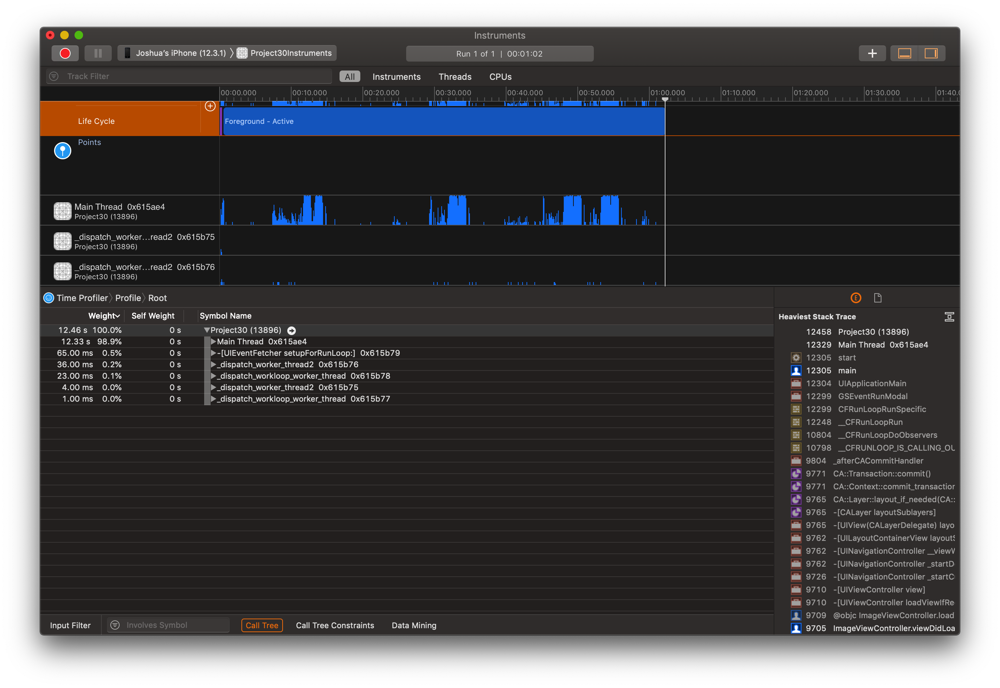
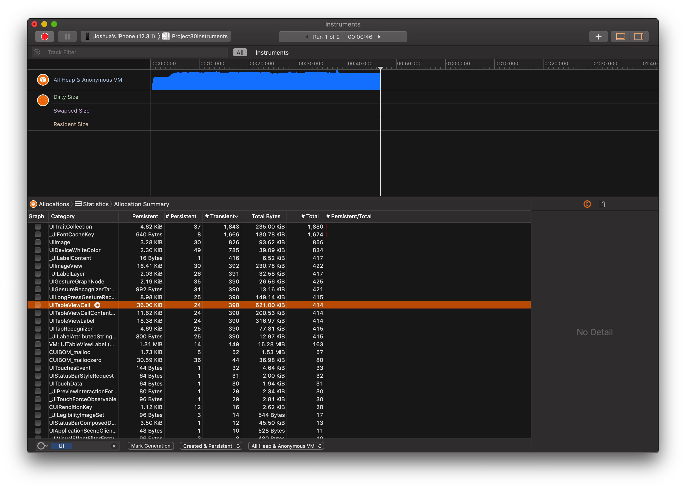

# 100 Days of Swift - "Instruments"

**Start Date: June 5, 2019  
End Date: September 13, 2019**

I want to learn how to program in the Swift language. To this end, I will practice coding in Swift for at least one hour every day for 100 days.

This is an example iOS project produced by [*Hacking with Swift*](https://www.hackingwithswift.com/read) called ["Instruments"](https://www.hackingwithswift.com/read/30/overview). This project is designed to teach me about using Instrumnets in Xcode.

## Daily progress of "Instruments"

**Day 1 - August 14, 2019**

The base project was a simple table view app with circular icons in each cell. When tapped, a detail view controller loaded with the full (massive) images and recorded the number of times it was tapped on. It was a very slow app - for many reasons - so we used Time Profiler and Acllocations in the Instruments in Xcode.

