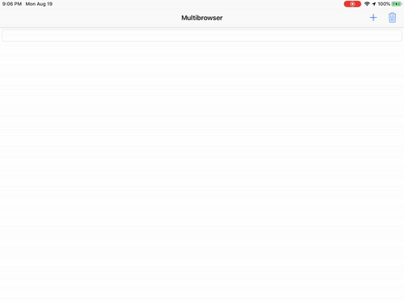

# 100 Days of Swift - "Multibrowser" iOS App

**Start Date: June 5, 2019  
End Date: September 13, 2019**

I want to learn how to program in the Swift language. To this end, I will practice coding in Swift for at least one hour every day for 100 days.

This is an example iOS project produced by [*Hacking with Swift*](https://www.hackingwithswift.com/read) called ["Multibrowser"](https://www.hackingwithswift.com/read/31/overview). This app is designed to teach me about a few more components of iOS and UIKit by making a browser that can have multiple windows open and viewable at a time (on the iPad, of course). I will post images below of the view of the app after each day's work.

## Daily progress of "Multibrowser" app

**Day 1 - August 19, 2019**

We created a `UIStackView` and added the ability to add arranged views (not subviews!!). We made these `WKWebViews` and let the user select one to change the URL.

**Day 2 - August 20, 2019**

We finished up the app by adding a way to delete views. I also learned about how the split-screen system works for iPad and we implemented a feature that splits the web views vertically when the iPad view is "compact."

