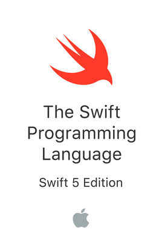

# 100 Days of Swift - *The Swift Programming Language*

I want to learn how to program in the Swift language. To this end, I will practice coding in Swift for at least one hour every day for 100 days.

I started this 100 Days of Code challenge by working through the first two chapters of [*The Swift Programming Language*](https://books.apple.com/us/book/the-swift-programming-language-swift-5-0/id881256329) ebook from Apple:

